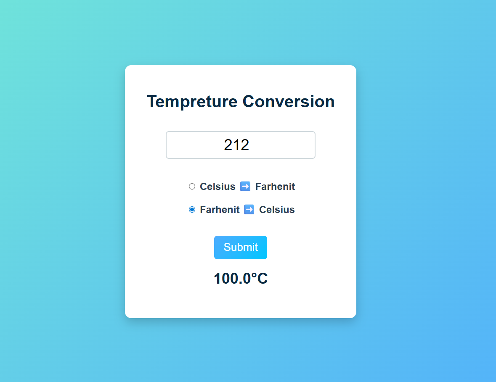

# 🌡️ Temperature Conversion Website

A simple temperature conversion web application that converts temperatures between **Celsius and Fahrenheit**.
This project is built using **HTML, CSS, and JavaScript** and provides a clean and user-friendly interface.

---

## 🚀 Features

* Convert **Celsius to Fahrenheit**
* Convert **Fahrenheit to Celsius**
* Simple and responsive UI
* Instant result display
* Beginner-friendly JavaScript logic

---

## 🛠️ Technologies Used

* **HTML** – Structure of the web page
* **CSS** – Styling and layout
* **JavaScript** – Temperature conversion logic

---

## 📷 Project Preview



---

## 📂 How to Run the Project

1. Clone the repository

```
git clone https://github.com/your-username/Tempreture_Conversion.git
```

2. Open the project folder.

3. Open `index.html` in your browser.

---

## 📖 Temperature Conversion Formulas

* **Celsius to Fahrenheit**

```
F = (C × 9/5) + 32
```

* **Fahrenheit to Celsius**

```
C = (F − 32) × 5/9
```

---

## 🎯 Learning Purpose

This project was created to practice:

* DOM manipulation in JavaScript
* Form input handling
* Basic UI styling with CSS

---

⭐ If you like this project, feel free to give it a star on GitHub!
